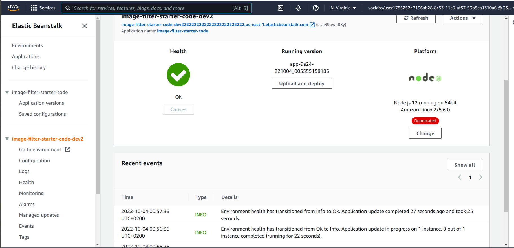

# Udagram Image Filtering Microservice

## the elasticbeanstack endpoint is

http://image-filter-starter-code-dev2222222222222222222222222.us-east-1.elasticbeanstalk.com/
## elastic beanstack screenshot

## Project Structure

deployment_screenshots

- image_filter_microservice.postman_collection.json --> postman collection for the project
- tsconfig.json
- README --> contains elasticbeanstack url
- tslint.json
- README.md
- package.json
- src --> source file of our project
